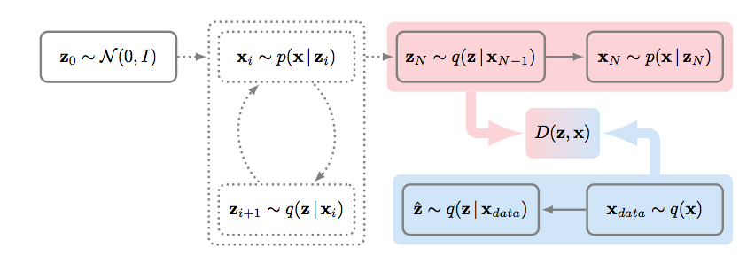
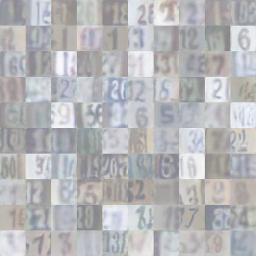

# RGNet

PyTorch implementation of RGNet which is based on [GibbsNet: Iterative Adversarial Inference for Deep Graphical Models](https://arxiv.org/abs/1712.04120).



## Requirements

- Python 3
- Pytorch
- visdom

## Usage

SVHN, CIFAR10, MNIST dataset are currently supported.

### Train
    
- For original GibbsNet using ALI parameters
```    
    $ python train.py --model=GibbsNet --batch_size=100 --lr=1e-4 --dataset=SVHN --gpu_ids=0 --sampling_count=20 --epoch=100
    $ python train.py --model=GibbsNet --batch_size=100 --lr=1e-4 --dataset=CIFAR --gpu_ids=0 --sampling_count=20 --epoch=100
    $ python train.py --model=GibbsNet --batch_size=100 --lr=1e-5 --dataset=MNIST --gpu_ids=0 --sampling_count=20 --epoch=300
    
    $ python train.py --model=RGibbsNet --batch_size=100 --lr=1e-4 --dataset=CIFAR10 --gpu_ids=0 --sampling_count=20 --inferring_count=1 --epoch=100
    $ python train.py --model=RGibbsNet --batch_size=100 --lr=1e-4 --dataset=CIFAR10 --gpu_ids=0 --sampling_count=20 --inferring_count=2 --epoch=100
    $ python train.py --model=GibbsNet --batch_size=100 --lr=1e-4 --dataset=CIFAR10 --gpu_ids=0 --sampling_count=20 --epoch=100
    
    $ python train.py --model=RGibbsNet --batch_size=100 --lr=1e-5 --dataset=SVHN --gpu_ids=0 --sampling_count=20 --inferring_count=1 --epoch=100
    $ python train.py --model=RGibbsNet --batch_size=100 --lr=1e-5 --dataset=SVHN --gpu_ids=0 --sampling_count=20 --inferring_count=2 --epoch=100
    $ python train.py --model=GibbsNet --batch_size=100 --lr=1e-5 --dataset=SVHN --gpu_ids=0 --sampling_count=20 --inferring_count=1 --epoch=100
    
    $ python train.py --model=RGibbsNet --batch_size=100 --lr=1e-5 --dataset=MNIST --gpu_ids=0 --sampling_count=20 --inferring_count=1 --epoch=300 --print_freq=1000 --plot_freq=1000
    $ python train.py --model=GibbsNet --batch_size=100 --lr=1e-5 --dataset=MNIST --gpu_ids=0 --sampling_count=20 --inferring_count=1 --epoch=300
```
### Visualize

- To visualize intermediate results and loss plots, run `python -m visdom.server` and go to the URL http://localhost:8097

### Test
    $ python test.py --test_count=20 --model=GibbsNet --repeat_generation=10
    
### Output generated images
    # generate 50000 images
    $ python test_50k.py --test_count=500 --model=GibbsNet --repeat_generation=100 --is_train=1 --epoch=100 --dataset=SVHN
    $ python test_50k.py --test_count=500 --model=RGibbsNet --repeat_generation=100 --is_train=1 --epoch=100 --dataset=SVHN
    $ python test_50k.py --test_count=500 --model=GibbsNet --repeat_generation=100 --is_train=1 --epoch=200 --dataset=MNIST --input_channel=1 --width=28 --height=28
    $ python test_50k.py --test_count=500 --model=RGibbsNet --repeat_generation=100 --is_train=1 --epoch=200 --dataset=MNIST --input_channel=1 --width=28 --height=28
    $ python test_50k.py --test_count=500 --model=GibbsNet --repeat_generation=100 --is_train=1 --epoch=100 --dataset=CIFAR10
    $ python test_50k.py --test_count=500 --model=RGibbsNet --repeat_generation=100 --is_train=1 --epoch=100 --dataset=CIFAR10
    
    $ python test_reconstruction.py --test_count=64 --model=RGibbsNet --repeat_generation=2 --is_train=0 --dataset=SVHN --epoch=100 # reconstruct 64 images

- Test result will generate in `./[opt.test_dir]/[opt.model/`, of which default value is `./test/GibbsNet/`
- Test result consists of `real_[i].png` files and `fake_[i]_[j].png` files. `real_[i].png` files are sampled from real dataset, and `fake_[i]_[j].png` files are generated from sampled latent variable of `real_[i].png`

### MLP SSL Test
- CIFAR10
```
    $ python ssl_lvdataset.py --test_count=1 --model=GibbsNet --dataset=CIFAR10 --repeat_generation=250 --is_train=1 --epoch=100
    $ python ssl_lvdataset.py --test_count=1 --model=GibbsNet --dataset=CIFAR10 --repeat_generation=250 --is_train=0 --epoch=100
    $ python ssl_lvdataset.py --test_count=1 --model=RGibbsNet --dataset=CIFAR10 --repeat_generation=250 --is_train=1 --epoch=100
    $ python ssl_lvdataset.py --test_count=1 --model=RGibbsNet --dataset=CIFAR10 --repeat_generation=250 --is_train=0 --epoch=100
```
- SVHN
```
    $ python ssl_lvdataset.py --test_count=1 --model=GibbsNet --dataset=SVHN --repeat_generation=250 --is_train=1 --epoch=100
    $ python ssl_lvdataset.py --test_count=1 --model=GibbsNet --dataset=SVHN --repeat_generation=250 --is_train=0 --epoch=100
    $ python ssl_lvdataset.py --test_count=1 --model=RGibbsNet --dataset=SVHN --repeat_generation=250 --is_train=1 --epoch=100
    $ python ssl_lvdataset.py --test_count=1 --model=RGibbsNet --dataset=SVHN --repeat_generation=250 --is_train=0 --epoch=100
    $ python mlp_train.py
    $ python mlp_test.py
    $ python ssl_get_infervisuals.py --model=RGibbsNet --dataset=SVHN --is_train=1 --epoch=100
    $ python ssl_get_infervisuals.py --model=RGibbsNet --dataset=SVHN --is_train=0 --epoch=100
    

```    
- MNIST
```
    $ python ssl_lvdataset.py --test_count=1 --model=GibbsNet --dataset=MNIST --repeat_generation=250 --is_train=1 --epoch=300
    $ python ssl_lvdataset.py --test_count=1 --model=GibbsNet --dataset=MNIST --repeat_generation=250 --is_train=0 --epoch=300
    $ python ssl_lvdataset.py --test_count=1 --model=RGibbsNet --dataset=MNIST --repeat_generation=250 --is_train=1 --epoch=300
    $ python ssl_lvdataset.py --test_count=1 --model=RGibbsNet --dataset=MNIST --repeat_generation=250 --is_train=0 --epoch=300
    $ python mlp_train.py
    $ python mlp_test.py
```

## Results

### 1. SVHN
- `epoch` 100, `lr` 1e-4, `sampling_count` 20
- generated results
<p>
    <br>
</p>

### 2. CIFAR10
- Construct by lzh
- `epoch` 100, `lr` 1e-4, `sampling_count` 20

### 3. MINST
- Construct by lzh
- `epoch` 100, `lr` 1e-5, `sampling_count` 20

## Implementation detail
- Original implementation of discriminator network for CIFAR10 dataset uses maxout activation layer, but this implementation uses leaky ReLU rather than maxout layer because of lack of GPU memory.
- all hyper parameters references to paper [Adversarially Learned Inference](https://arxiv.org/abs/1606.00704).
- To train GibbsNet, appropriate learning rate is `1e-5` for sampling count 20. You can increase learning rate when you sample less than 20 times.

## TODOs
- Custom dataset support
- Visualize test results

## Code reference

Visualization code(visualizer.py, utils.py) references to pytorch-CycleGAN-and-pix2pix(https://github.com/junyanz/pytorch-CycleGAN-and-pix2pix) by [Jun-Yan Zhu](https://github.com/junyanz)

## Author

[Tony Kim](https://github.com/wlwkgus)
