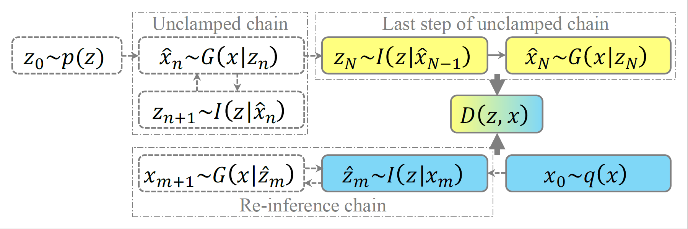

# RGNet

PyTorch implementation of RGNet [RGNet: Iterative Adversarial Inference with Re-inference Chain for Deep Graphical Models].



## Requirements

- Python 3.6
- Pytorch 0.4+
- other: pip install visdom, etc.

## Usage

SVHN, CIFAR10, MNIST dataset.

### Train
- Train RGNet
```     
    $ python train.py --model=RGibbsNet --batch_size=100 --lr=1e-4 --dataset=CIFAR10 --gpu_ids=1 --sampling_count=20 --inferring_count=1 --epoch=100
    $ python train.py --model=RGibbsNet --batch_size=100 --lr=1e-4 --dataset=CIFAR10 --gpu_ids=0 --sampling_count=20 --inferring_count=2 --epoch=100
	
    $ python train.py --model=RGibbsNet --batch_size=100 --lr=1e-5 --dataset=SVHN --gpu_ids=0 --sampling_count=20 --inferring_count=1 --epoch=100
    $ python train.py --model=RGibbsNet --batch_size=100 --lr=1e-5 --dataset=SVHN --gpu_ids=0 --sampling_count=20 --inferring_count=2 --epoch=100
	
    $ python train.py --model=RGibbsNet --batch_size=100 --lr=1e-5 --dataset=MNIST --gpu_ids=0 --sampling_count=20 --inferring_count=1 --epoch=300 --print_freq=1000 --plot_freq=1000
    $ python train.py --model=RGibbsNet --batch_size=100 --lr=1e-5 --dataset=MNIST --gpu_ids=0 --sampling_count=20 --inferring_count=2 --epoch=300 --print_freq=1000 --plot_freq=1000
```
- Train GibbsNet
```
    $ python train.py --model=GibbsNet --batch_size=100 --lr=1e-4 --dataset=CIFAR10 --gpu_ids=0 --sampling_count=20 --epoch=100
    $ python train.py --model=GibbsNet --batch_size=100 --lr=1e-5 --dataset=SVHN --gpu_ids=0 --sampling_count=20 --epoch=100
    $ python train.py --model=GibbsNet --batch_size=100 --lr=1e-5 --dataset=MNIST --gpu_ids=0 --sampling_count=20 --epoch=300
```
-  Train ALI
```
    $ python train.py --model=GibbsNet --batch_size=100 --lr=1e-4 --dataset=CIFAR10 --gpu_ids=1 --sampling_count=0 --epoch=100
    $ python train.py --model=GibbsNet --batch_size=100 --lr=1e-5 --dataset=SVHN --gpu_ids=1 --sampling_count=0 --epoch=100
    $ python train.py --model=GibbsNet --batch_size=100 --lr=1e-5 --dataset=MNIST --gpu_ids=1 --sampling_count=0 --epoch=300
```

### Visualize

- To visualize intermediate results and loss plots, run `python -m visdom.server` and go to the URL http://localhost:8097

### Test
    $ python test.py --test_count=20 --model=GibbsNet --repeat_generation=10

### Output generated images
    # generate 50000 images
    $ python test_50k.py --test_count=500 --model=GibbsNet --repeat_generation=100 --is_train=1 --epoch=100 --dataset=SVHN --sampling_count=20
    $ python test_50k.py --test_count=500 --model=RGibbsNet --repeat_generation=100 --is_train=1 --epoch=100 --dataset=SVHN --sampling_count=20
    $ python test_50k.py --test_count=500 --model=GibbsNet --repeat_generation=100 --is_train=1 --epoch=200 --dataset=MNIST --input_channel=1 --width=28 --height=28
    $ python test_50k.py --test_count=500 --model=RGibbsNet --repeat_generation=100 --is_train=1 --epoch=200 --dataset=MNIST --input_channel=1 --width=28 --height=28
    $ python test_50k.py --test_count=500 --model=GibbsNet --repeat_generation=100 --is_train=1 --epoch=100 --dataset=CIFAR10 --sampling_count=20
    $ python test_50k.py --test_count=500 --model=RGibbsNet --repeat_generation=100 --is_train=1 --epoch=100 --dataset=CIFAR10 --sampling_count=20
    $ python test_50k.py --test_count=500 --model=HALI --repeat_generation=100 --is_train=1 --epoch=100 --dataset=CIFAR10
    
    $ python test_reconstruction.py --test_count=64 --model=RGibbsNet --repeat_generation=20 --is_train=0 --dataset=SVHN --epoch=100 --sampling_count=20 # reconstruct 64 images
    $ python test_reconstruction.py --test_count=64 --model=RGibbsNet --repeat_generation=20 --is_train=0 --dataset=SVHN --epoch=100 --sampling_count=20 # reconstruct 64 images
    $ python test_reconstruction.py --test_count=200 --model=RGibbsNet --is_train=1 --dataset=SVHN --epoch=100 --sampling_count=20 --batch_size=10# reconstruct 64 images

- Test result will generate in `./[opt.test_dir]/[opt.model/`, of which default value is `./test/GibbsNet/`
- Test result consists of `real_[i].png` files and `fake_[i]_[j].png` files. `real_[i].png` files are sampled from real dataset, and `fake_[i]_[j].png` files are generated from sampled latent variable of `real_[i].png`

### MLP SSL Test
- CIFAR10
```
    $ python ssl_lvdataset.py --test_count=1 --model=GibbsNet --dataset=CIFAR10 --repeat_generation=250 --is_train=1 --epoch=100
    $ python ssl_lvdataset.py --test_count=1 --model=GibbsNet --dataset=CIFAR10 --repeat_generation=250 --is_train=0 --epoch=100
    $ python ssl_lvdataset.py --test_count=1 --model=RGibbsNet --dataset=CIFAR10 --repeat_generation=250 --is_train=1 --epoch=100
    $ python ssl_lvdataset.py --test_count=1 --model=RGibbsNet --dataset=CIFAR10 --repeat_generation=250 --is_train=0 --epoch=100
```
- SVHN
```
    $ python ssl_lvdataset.py --test_count=1 --model=GibbsNet --dataset=SVHN --repeat_generation=250 --is_train=1 --epoch=100
    $ python ssl_lvdataset.py --test_count=1 --model=GibbsNet --dataset=SVHN --repeat_generation=250 --is_train=0 --epoch=100
    $ python ssl_lvdataset.py --test_count=1 --model=RGibbsNet --dataset=SVHN --repeat_generation=250 --is_train=1 --epoch=100
    $ python ssl_lvdataset.py --test_count=1 --model=RGibbsNet --dataset=SVHN --repeat_generation=250 --is_train=0 --epoch=100
    $ python mlp_train.py
    $ python mlp_test.py
    $ python ssl_get_infervisuals.py --model=RGibbsNet --dataset=SVHN --is_train=1 --epoch=100
    $ python ssl_get_infervisuals.py --model=RGibbsNet --dataset=SVHN --is_train=0 --epoch=100
```
- MNIST
```
    $ python ssl_lvdataset.py --test_count=1 --model=GibbsNet --dataset=MNIST --repeat_generation=250 --is_train=1 --epoch=300
    $ python ssl_lvdataset.py --test_count=1 --model=GibbsNet --dataset=MNIST --repeat_generation=250 --is_train=0 --epoch=300
    $ python ssl_lvdataset.py --test_count=1 --model=RGibbsNet --dataset=MNIST --repeat_generation=250 --is_train=1 --epoch=300
    $ python ssl_lvdataset.py --test_count=1 --model=RGibbsNet --dataset=MNIST --repeat_generation=250 --is_train=0 --epoch=300
    $ python mlp_train.py
    $ python mlp_test.py
```

## Results

## Implementation detail
- Need to annotate some import codes in model.ali.py for train model using different dataset

## Code reference
Code references to https://github.com/wlwkgus/GibbsNet.git

## Author
(https://github.com/hhqweasd)
